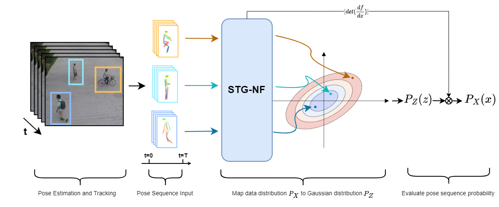

# Normalizing Flows for Human Pose Anomaly Detection
[](https://arxiv.org/abs/2211.10946)
[](https://paperswithcode.com/sota/anomaly-detection-on-shanghaitech?p=normalizing-flows-for-human-pose-anomaly)
[](https://paperswithcode.com/sota/anomaly-detection-on-ubnormal?p=normalizing-flows-for-human-pose-anomaly)


The official PyTorch implementation of the paper[**"Normalizing Flows for Human Pose Anomaly Detection"*](https://arxiv.org/abs/2211.10946).




## Cititation
If you find this useful, please cite this work as follows:
```
@article{hirschorn2022human,
  title = {Normalizing Flows for Human Pose Anomaly Detection},
  author = {Hirschorn, Or and Avidan, Shai},
  journal={arXiv preprint arXiv:2211.10946},
  year = {2022},
}
```

## Getting Started

This code was tested on `Ubuntu 20.04.4 LTS` and requires:
* Python 3.8
* conda3 or miniconda3
* CUDA capable GPU (one is enough)

### Setup Conda Environment:
```
git clone https://github.com/orhir/STG-NF
cd STG-NF

# Conda environment setup
conda env create -f environment.yml
conda activate STG-NF
```

### Directory Structure
```
.
├── checkpoints
├── data
│   ├── ShanghaiTech
│   │   ├── gt
│   │   │   └── test_frame_mask
│   │   └── pose
│   │       ├── test
│   │       └── train
│   └── UBnormal
│       ├── gt
│       ├── pose
│       │   ├── abnormal_train
│       │   ├── test
│       │   ├── train
│       │   └── validation
│       └── videos
├── models
│   └── STG_NF
└── utils

```

### Data Directory
Data folder, including extracted poses and GT, can be downloaded using the [link](https://drive.google.com/file/d/1o9h3Kh6zovW4FIHpNBGnYIRSbGCu-qPt/view?usp=sharing).

The data directory holds pose graphs and ground truth vectors for the datasets.
A path for the directory may be configured using the arguments:

    --vid_path_train
    --vid_path_test
    --pose_path_train
    --pose_path_train_abnormal
    --pose_path_test

### Custom Dataset
We provide a script for creating JSON files in the accepted format using [AlphaPose](https://github.com/MVIG-SJTU/AlphaPose).
Please download into pretrained_models folders [fast_421_res152_256x192.pth](https://drive.google.com/open?id=1kfyedqyn8exjbbNmYq8XGd2EooQjPtF9)
It is also recommended to use the YOLOX-X detector, which can be downloaded from the AlphaPose repository.
Use the flag --video for video folder, otherwise assumes a folder of JPG/PNG images for each video.
    python gen_data.py --alphapose_dir /path/to/AlphaPoseFloder/ --dir /input/dir/ --outdir /output/dir/ [--video]

## Training/Testing
Training and Evaluating is run using:
```
python train_eval.py --dataset [ShanghaiTech\UBnormal]
```

Evaluation of our pretrained model can be done using:

ShanghaiTech/ShanghaiTech-HR:
```
python train_eval.py --dataset [ShanghaiTech/ShanghaiTech-HR] --checkpoint checkpoints/ShanghaiTech_85_9.tar
```
Unsupervised UBnormal
```
python train_eval.py --dataset UBnormal --seg_len 16 --checkpoint checkpoints/UBnormal_unsupervised_71_8.tar 
```
Supervised UBnormal
```
python train_eval.py --dataset UBnormal --seg_len 16 --R 10 --checkpoint checkpoints/UBnormal_supervised_79_2.tar
```

## References
Our code is based on code from:
- [Graph Embedded Pose Clustering for Anomaly Detection](https://github.com/amirmk89/gepc)
- [Glow](https://github.com/y0ast/Glow-PyTorch)